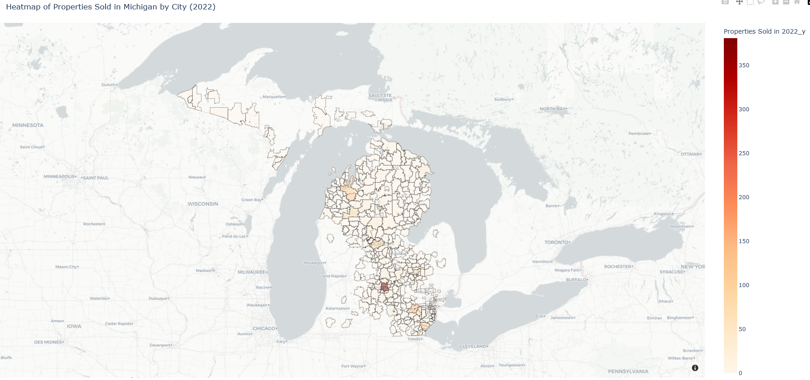
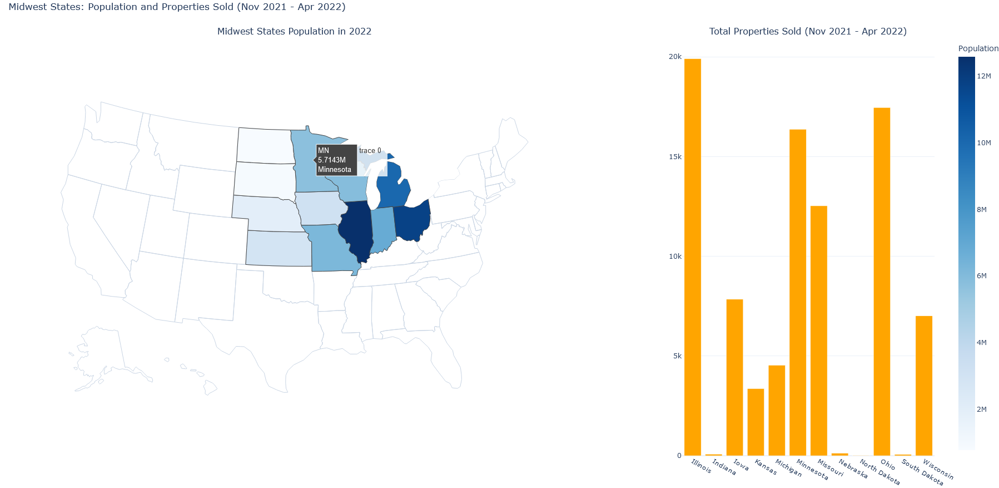

# Project 1 - Real Estate Market Analysis

## Overview

This project provides a comprehensive analysis of real estate data from Mississippi, Michigan, and the broader Midwest, focusing on two primary aspects. First, it examines how the number of bedrooms impacts property prices in Mississippi, revealing a clear correlation between increased bedroom count and higher property values. Second, the project explores property sales trends in Michigan from 2021 to 2022, placing these trends within the context of other Midwestern states. This analysis includes a detailed examination of average property prices, sales volumes, and other key indicators, offering valuable insights into the dynamics of the housing market across these regions.

### Questions
1. What is the average price of homes in different states and  how does it compare to the national average?
2. How does bedroom count impact the average price of a property in Mississippi?
3. Is there a correlation between population size and the number of properties sold in the Midwest?

## Average Price of Homes and Comparison to National Average

The analysis aimed to discover the average prices of homes sold and bought in the 50 states present in the data set. It aimed to show the disparity in cost of living and the differences in property prices across different states

#### Findings

1. **Most expensive states**: The analysis uncovered that the top three states were Hawaii, Virgin Islands and District of Columbia(All clocking an average of 12 million dollars going up)
2. **Comparison to the national average**: Using the mean function, a dotted line was drawn representing the national average on the bar graph representing the states' averages. The average prices of homes in 40% of the states was above the national average with 60% of the states being below the national average.
   
### Visualizations

**[Average Price of Homes in Different States](https://imgur.com/G6oqKiY.png)**

**[Average Price of Homes in Different States Compared to National Average](https://imgur.com/1Zho5H1.png)**

## Mississippi Real Estate Analysis: Impact of Bedroom Count on Property Prices

The analysis of real estate data from Mississippi focused on understanding how the number of bedrooms in a property impacts its price. The data was used to generate a trend line that demonstrates the relationship between the number of bedrooms and the average price of homes in Mississippi.

#### Findings

1. **Positive Correlation**: There is a strong positive correlation between the number of bedrooms and the average price of a home. As the number of bedrooms increases, so does the average price, with properties having more bedrooms commanding significantly higher prices.
2. **Price Growth by Bedroom Count**: The analysis shows that homes with more than four bedrooms see a steep increase in price, indicating higher demand or larger home sizes as contributing factors.

### Visualizations

**[Average price of Homes in Mississippi based on Number of Bedrooms](https://imgur.com/y30ke8c.png)**

## Michigan/Midwestern Real Estate Sales (2021 vs 2022)

This analysis aimed to uncover trends in property sales across cities in Michigan and compare these findings with other Midwestern states from 4Q 2021 to 1Q 2022. The number of properties sold in each city was plotted to identify areas with significant activity, providing insights into both local dynamics within Michigan and broader regional trends across the Midwest.

### Findings
- **Michigan Property Sales Concentration**: The heatmap highlights a higher concentration of property sales in urban areas such as Lansing and Ann Arbor in the Lower Peninsula, while the Upper Peninsula shows significantly lower sales, with most cities reporting only single-digit figures.
- **Midwest Region Comparison**: A comparative analysis across Midwest states revealed outliers in the first and last months of the data, leading to their exclusion in the final analysis. Findings indicate that the Midwest states with the highest populations—Illinois, Ohio, and Michigan—also have the highest property sales, which aligns with their significant populations. The relationship between population and property sales is evident; however, outliers like Indiana require additional research. Stakeholders should consider both population and market-specific factors (such as crime data, job listings, and median income) when evaluating real estate opportunities in the Midwest.
-  **Data Limitations**: The dataset provided only 6-7 months of sold sales data, insufficient for a reliable time trend analysis. Michigan, for example, had only 6 months of data, though it's growth rate mirrored the sold trend in the other states. As mentioned above Indiana has low sales numbers, but this appears to be an error as a result of the web scraping, as the original dataset indicates only 117 properties were sold in Michigan between Nov 2021 - Apr 2022, which is unreasonably low.

### Visualizations

**[Michigan Heatmap by City - Interactive Heatmap](https://htmlpreview.github.io/?https://raw.githubusercontent.com/njaunick/Project1-Team4-/terry-final/Presentation_resources/Terry/plotly_figure_1_heatmap.html)**
- Shows concentration of property sales in Michigan cities.

**[Midwest States: Population and Properties Sold (Nov 2021 - Apr 2022) - Interactive Heatmap](https://html-preview.github.io/?url=https://raw.githubusercontent.com/njaunick/Project1-Team4-/main/Presentation_resources/Terry/plotly_figure_8_midwest_sales_heatmap.html)**
- Compares population size with sales data, uncovering inconsistencies.
  

### Technical Details

- **Dataset**: The dataset was sourced from [Kaggle](https://www.kaggle.com/datasets/ahmedshahriarsakib/usa-real-estate-dataset) and processed using Python's pandas and matplotlib/plotly libraries.
- **Code**: The scripts for data cleaning, processing, and visualization are included in the repository. The analysis was conducted in Google Colab for clarity and reproducibility.

### Team Members
- Terry Brown
- Nickson Njau